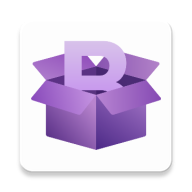

<div align="center">



# ByeBox

**A modern, Material You VPN / proxy client for Android — powered by Xray.**

[](https://github.com/PerQ4/ByeBox/releases)
[](LICENSE)
[](#building-from-source)
[](https://kotlinlang.org)
[](https://developer.android.com/jetpack/compose)
[](https://github.com/XTLS/Xray-core)

| **Version** | **Build** | **Released** | **Download** |
|:---:|:---:|:---:|:---:|
| **1.2.2** | `23` | 2026-09-24 | [universal APK](https://github.com/PerQ4/ByeBox/releases/latest/download/byebox-universal-release.apk) |

[English](#english) · [Русский](#русский)

</div>

---

## English

### 📖 About

**ByeBox** is an Android client for Xray/V2Ray-based proxy protocols. It pairs a
fully custom **Material You (Material 3)** interface with the proven connection
engine of [v2rayNG](https://github.com/2dust/v2rayNG) and
[Xray-core](https://github.com/XTLS/Xray-core), and ships with a built-in local
**Telegram MTProto proxy**.

### ✨ Features

**🎨 Interface**
- Material You (Material 3): dynamic color, light/dark themes, several palettes
- Glassmorphic blurred navigation dock ([Haze](https://github.com/chrisbanes/haze))
- Spring micro-animations and tactile/haptic feedback
- Reorderable tabs and settings sections
- First-run onboarding
- Fully localized in **English, Russian and Chinese**

**🛡 Connection**
- System-level **VpnService** integration
- Protocols: **VLESS, VMess, Trojan, Shadowsocks, SOCKS, HTTP(S)** and subscriptions
- **HevTun** (tun2socks) mode via a bundled `libhev-socks5-tunnel`
- TUN stack selection: **gVisor** / system
- IPv6 tunnel, prefer-IPv6, LAN bypass, LAN sharing, local SOCKS port, VPN mode

**🧭 Routing**
- Presets: *Bypass LAN/CN/RU*, *Proxy all*, *Direct*
- Custom direct / proxy rules (geoip, geosite, domains, IPs)
- **Per-app routing**: proxy only selected apps, or bypass selected apps
- Domain strategy and outbound resolve options
- Sniffing, TLS fragmentation, mux, fake DNS

**🌐 DNS**
- System default, Cloudflare, Google, AdGuard, or a custom resolver

**✈️ Telegram**
- Built-in local **MTProto proxy** (TG WS Proxy)
- Cloudflare WebSocket and direct-datacenter modes
- Per-client bypass — the chosen Telegram client goes direct, around the VPN
- Auto-start with the app and Quick Settings control

**📊 Management**
- Subscription import with auto-refresh
- QR-code scanning, import from clipboard, share links
- Live traffic statistics, latency testing (manual / periodic) and logs
- **Quick Settings tiles**: connection toggle and profile switcher
- Settings export / import
- **In-app updater** — finds every release (pre-releases included), verifies the APK's
  **SHA-256**, shows download progress with cancel, and lets you **skip a version** or be
  **reminded later**; auto-check can be turned off

### 📥 Download

Grab the latest APK from the [**Releases**](https://github.com/PerQ4/ByeBox/releases) page.

> ℹ️ ByeBox follows the versioning scheme described in [**Versioning**](#-versioning).
> The current release is **`1.2.2`** (`versionCode 23`). The universal APK targets `arm64-v8a`.

No proxy servers or subscriptions are included — bring your own.

### 🔢 Versioning

ByeBox uses **SemVer** `MAJOR.MINOR.PATCH[-stage.N]` with Minecraft-style lifecycle stages
(`alpha → beta → rc → release`). Every part has a clear meaning, the build date/number live
separately from the version string, and the in-app updater compares builds by the Android
`versionCode` — so it keeps working even across a public renaming.

- 📐 Policy: [docs/version_naming_policy.md](docs/version_naming_policy.md)
- 🚀 Release process: [docs/release_process.md](docs/release_process.md)

> ⚠️ Builds from the old `9.0` line compared versions by name, so they won't auto-update to
> the new line. Install a `1.2.x` build once manually — later builds update themselves.

### 🚀 Building from source

#### Requirements

| Tool | Version |
|------|---------|
| Android Studio | Ladybug or newer |
| Android SDK | **36** to compile · **min SDK 24** (Android 7.0) |
| JDK | **17** |
| Rust + `cargo-ndk` + Android NDK | only to build the Telegram proxy native library |

#### Steps

```bash
# 1. Clone ByeBox
git clone https://github.com/PerQ4/ByeBox.git
cd ByeBox

# 2. Clone the Telegram WS Proxy module (required by settings.gradle.kts, GPL-3.0)
git clone https://github.com/amurcanov/tg-ws-proxy-android.git tgwsproxy

# 3. (optional) build the native Telegram-proxy library
rustup target add aarch64-linux-android armv7-linux-androideabi
cargo install cargo-ndk
cargo ndk -t arm64-v8a --platform 24 -o tgwsproxy/app/src/main/jniLibs build --release

# 4. Build
./gradlew assembleDebug      # debug
./gradlew assembleRelease    # signed release
```

> **Signing.** Both build types are signed from `keystore/byebox.jks`, which is
> *not* committed. Either drop your own keystore at that path, or point Gradle to
> it in `local.properties`:
>
> ```properties
> BYEBOX_KEYSTORE_PATH=keystore/your.jks
> BYEBOX_KEYSTORE_PASSWORD=******
> BYEBOX_KEY_ALIAS=your_alias
> BYEBOX_KEY_PASSWORD=******
> ```

#### Project structure

| Path | Description |
|------|-------------|
| `app/src/main/java/com/perqa/byebox/` | UI (Compose), screens, ViewModels, theme, services, tile services |
| `app/src/main/java/com/v2ray/ang/` | Protocol handling, config generator, MMKV handlers, utilities (from v2rayNG) |
| `app/libs/libv2ray.aar` | Xray-core wrapper built with gomobile |
| `app/src/main/jniLibs/` | Prebuilt `libhev-socks5-tunnel.so` (HevTun) |
| `gomobile-patch/` | gomobile patch used to build the Xray AAR |
| `tgwsproxy/` | Telegram WS proxy module — cloned separately (see above) |
| `docs/` | Versioning policy, release process, mascot brief |

### 🧱 Tech stack

Kotlin · Jetpack Compose & Material 3 · Navigation 3 · Coroutines & Flow ·
DataStore · WorkManager · Haze · Xray-core (gomobile AAR) · MMKV · OkHttp ·
Gson · ZXing + ML Kit · CameraX · Rust (TG WS Proxy).

### 🤝 Acknowledgements

ByeBox stands on the shoulders of these projects:

- **[v2rayNG](https://github.com/2dust/v2rayNG)** — connection management and protocol parsing. ByeBox is a derivative work of it.
- **[Xray-core](https://github.com/XTLS/Xray-core)** — the core proxy engine.
- **[tg-ws-proxy-android](https://github.com/amurcanov/tg-ws-proxy-android)** by [@amurcanov](https://github.com/amurcanov) — the integrated Telegram MTProto/WS proxy (code from this project is used in ByeBox).
- **[Flowseal/tg-ws-proxy](https://github.com/Flowseal/tg-ws-proxy)** — the original MIT project behind the Android fork.
- **[hev-socks5-tunnel](https://github.com/heiher/hev-socks5-tunnel)** — tun2socks backend for HevTun.
- **[golang/mobile](https://github.com/golang/mobile)** — gomobile tooling for the Xray wrapper.
- The **AndroidX / Jetpack**, **Kotlin** and **Haze** teams.

### 📄 License

ByeBox is released under the **GNU General Public License v3.0**.

It is a derivative work of [v2rayNG](https://github.com/2dust/v2rayNG) (GPL-3.0),
whose connection-management and protocol code is used here; therefore ByeBox as a
whole is distributed under **GPL-3.0**.

- 📜 Full license text: [LICENSE](LICENSE)
- 📦 Third-party components and their licenses: [THIRD_PARTY_LICENSES.md](THIRD_PARTY_LICENSES.md)
- 🧩 Corresponding source of the bundled Telegram proxy module: [amurcanov/tg-ws-proxy-android](https://github.com/amurcanov/tg-ws-proxy-android)

### ⚠️ Disclaimer

ByeBox is a client only — it does **not** provide VPN servers, proxy nodes or
subscriptions. You are responsible for complying with the laws and service terms
that apply to you. The software is provided "as is", without warranty of any kind.

---

## Русский

### 📖 О проекте

**ByeBox** — Android-клиент для прокси-протоколов на базе Xray/V2Ray. Он сочетает
полностью переработанный интерфейс в стиле **Material You (Material 3)** с
проверенным движком подключения [v2rayNG](https://github.com/2dust/v2rayNG) и
[Xray-core](https://github.com/XTLS/Xray-core), а также включает встроенный
локальный **MTProto-прокси для Telegram**.

### ✨ Возможности

**🎨 Интерфейс**
- Material You (Material 3): динамические цвета, светлая/тёмная темы, несколько палитр
- Стеклянная размытая навигационная панель ([Haze](https://github.com/chrisbanes/haze))
- Пружинные микроанимации и тактильная отдача
- Перетаскивание вкладок и разделов настроек
- Приветственный экран при первом запуске
- Полная локализация: **русский, английский, китайский**

**🛡 Подключение**
- Системная интеграция через **VpnService**
- Протоколы: **VLESS, VMess, Trojan, Shadowsocks, SOCKS, HTTP(S)** и подписки
- Режим **HevTun** (tun2socks) со встроенной `libhev-socks5-tunnel`
- Выбор TUN-стека: **gVisor** / системный
- IPv6-туннель, Prefer-IPv6, обход локалки, LAN-шаринг, локальный SOCKS-порт, VPN-режим

**🧭 Маршрутизация**
- Профили: *Обход LAN/CN/RU*, *Проксировать всё*, *Напрямую*
- Свои правила direct / proxy (geoip, geosite, домены, IP)
- **Маршрутизация по приложениям**: проксировать только выбранные или исключать выбранные
- Стратегия разрешения доменов и outbound-resolve
- Sniffing, фрагментация TLS, mux, fake DNS

**🌐 DNS**
- Системный, Cloudflare, Google, AdGuard или свой сервер

**✈️ Telegram**
- Встроенный локальный **MTProto-прокси** (TG WS Proxy)
- Режимы Cloudflare WebSocket и прямых датацентров
- Обход по клиенту — выбранный Telegram идёт напрямую, минуя VPN
- Автозапуск вместе с приложением и управление из быстрых настроек

**📊 Управление**
- Импорт подписок с автообновлением
- Сканирование QR, импорт из буфера обмена, отправка ссылок
- Статистика трафика в реальном времени, проверка задержки (вручную / периодически), логи
- **Плитки быстрых настроек**: включение VPN и переключение профилей
- Экспорт / импорт настроек
- **Обновление из приложения** — находит все релизы (включая пре-релизы), проверяет
  **SHA-256** APK, показывает прогресс загрузки с отменой и позволяет **пропустить версию**
  или **напомнить позже**; автопроверку можно отключить

### 📥 Загрузка

Актуальный APK — на странице [**Releases**](https://github.com/PerQ4/ByeBox/releases).

> ℹ️ ByeBox следует схеме версионирования из раздела [**Версионирование**](#-версионирование).
> Текущий релиз — **`1.2.2`** (`versionCode 23`). Universal-APK рассчитан на `arm64-v8a`.

Серверы, узлы и подписки не входят в поставку — используйте свои.

### 🔢 Версионирование

ByeBox использует **SemVer** `MAJOR.MINOR.PATCH[-стадия.N]` со стадиями жизненного цикла
в духе старых Minecraft (`alpha → beta → rc → release`). Каждая часть имеет чёткий смысл,
дата и номер сборки хранятся отдельно от строки версии, а апдейтер сравнивает сборки по
Android-`versionCode` — поэтому он работает даже после публичного переименования.

- 📐 Политика: [docs/version_naming_policy.md](docs/version_naming_policy.md)
- 🚀 Процесс релиза: [docs/release_process.md](docs/release_process.md)

> ⚠️ Сборки старой линии `9.0` сравнивали версии по имени, поэтому на новую линию они сами не
> обновятся. Установите сборку `1.2.x` один раз вручную — дальше обновления приходят автоматически.

### 🚀 Сборка из исходников

#### Требования

| Инструмент | Версия |
|------------|--------|
| Android Studio | Ladybug или новее |
| Android SDK | **36** для компиляции · **min SDK 24** (Android 7.0) |
| JDK | **17** |
| Rust + `cargo-ndk` + Android NDK | только для нативной библиотеки Telegram-прокси |

#### Шаги

```bash
# 1. Клонируем ByeBox
git clone https://github.com/PerQ4/ByeBox.git
cd ByeBox

# 2. Клонируем модуль Telegram WS Proxy (требуется settings.gradle.kts, GPL-3.0)
git clone https://github.com/amurcanov/tg-ws-proxy-android.git tgwsproxy

# 3. (необязательно) собираем нативную библиотеку Telegram-прокси
rustup target add aarch64-linux-android armv7-linux-androideabi
cargo install cargo-ndk
cargo ndk -t arm64-v8a --platform 24 -o tgwsproxy/app/src/main/jniLibs build --release

# 4. Сборка
./gradlew assembleDebug      # debug
./gradlew assembleRelease    # подписанный release
```

> **Подпись.** Обе сборки подписываются ключом `keystore/byebox.jks`, которого
> **нет** в репозитории. Положите свой ключ по этому пути либо укажите его в
> `local.properties`:
>
> ```properties
> BYEBOX_KEYSTORE_PATH=keystore/your.jks
> BYEBOX_KEYSTORE_PASSWORD=******
> BYEBOX_KEY_ALIAS=your_alias
> BYEBOX_KEY_PASSWORD=******
> ```

#### Структура проекта

| Путь | Описание |
|------|----------|
| `app/src/main/java/com/perqa/byebox/` | Интерфейс (Compose), экраны, ViewModels, тема, сервисы, плитки |
| `app/src/main/java/com/v2ray/ang/` | Работа с протоколами, генератор конфигов, MMKV, утилиты (из v2rayNG) |
| `app/libs/libv2ray.aar` | Обёртка Xray-core, собранная через gomobile |
| `app/src/main/jniLibs/` | Готовая `libhev-socks5-tunnel.so` (HevTun) |
| `gomobile-patch/` | Патч gomobile для сборки Xray-обёртки |
| `tgwsproxy/` | Модуль Telegram WS Proxy — клонируется отдельно (см. выше) |
| `docs/` | Политика версионирования, процесс релиза, бриф по маскоту |

### 🧱 Технологии

Kotlin · Jetpack Compose и Material 3 · Navigation 3 · Coroutines и Flow ·
DataStore · WorkManager · Haze · Xray-core (AAR через gomobile) · MMKV · OkHttp ·
Gson · ZXing + ML Kit · CameraX · Rust (TG WS Proxy).

### 🤝 Благодарности

ByeBox опирается на эти проекты:

- **[v2rayNG](https://github.com/2dust/v2rayNG)** — управление соединениями и разбор протоколов. ByeBox — производная работа на его основе.
- **[Xray-core](https://github.com/XTLS/Xray-core)** — ядро проксирования.
- **[tg-ws-proxy-android](https://github.com/amurcanov/tg-ws-proxy-android)** от [@amurcanov](https://github.com/amurcanov) — встроенный Telegram MTProto/WS-прокси (код проекта используется в ByeBox).
- **[Flowseal/tg-ws-proxy](https://github.com/Flowseal/tg-ws-proxy)** — оригинальный проект (MIT), от которого произошёл Android-форк.
- **[hev-socks5-tunnel](https://github.com/heiher/hev-socks5-tunnel)** — tun2socks-бэкенд для HevTun.
- **[golang/mobile](https://github.com/golang/mobile)** — gomobile для обёртки Xray.
- Команды **AndroidX / Jetpack**, **Kotlin** и **Haze**.

### 📄 Лицензия

ByeBox распространяется под **GNU General Public License v3.0**.

Это производная работа от [v2rayNG](https://github.com/2dust/v2rayNG) (GPL-3.0),
чей код управления соединениями и разбора протоколов здесь используется, поэтому
ByeBox целиком распространяется под **GPL-3.0**.

- 📜 Полный текст лицензии: [LICENSE](LICENSE)
- 📦 Сторонние компоненты и их лицензии: [THIRD_PARTY_LICENSES.md](THIRD_PARTY_LICENSES.md)
- 🧩 Исходный код встроенного модуля Telegram-прокси: [amurcanov/tg-ws-proxy-android](https://github.com/amurcanov/tg-ws-proxy-android)

### ⚠️ Отказ от ответственности

ByeBox — это только клиент: он **не** предоставляет VPN-серверы, прокси-узлы или
подписки. Ответственность за соблюдение применимых законов и условий сервисов
лежит на вас. Программа предоставляется «как есть», без каких-либо гарантий.
